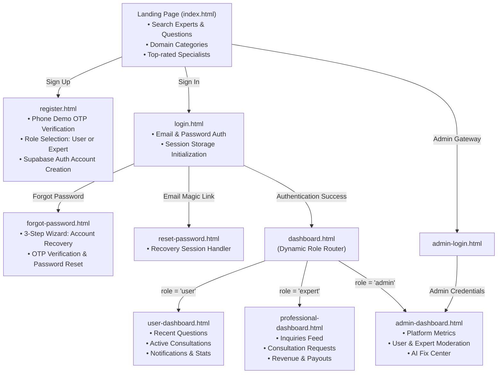
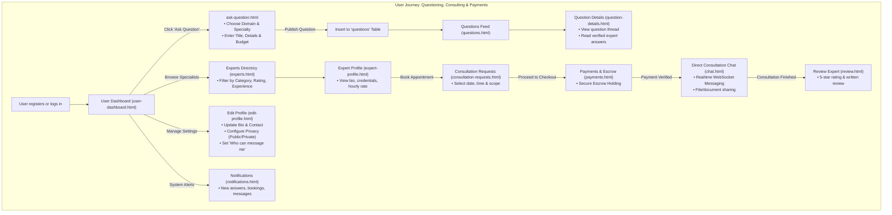
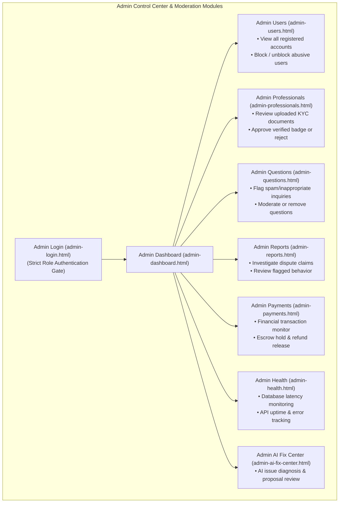
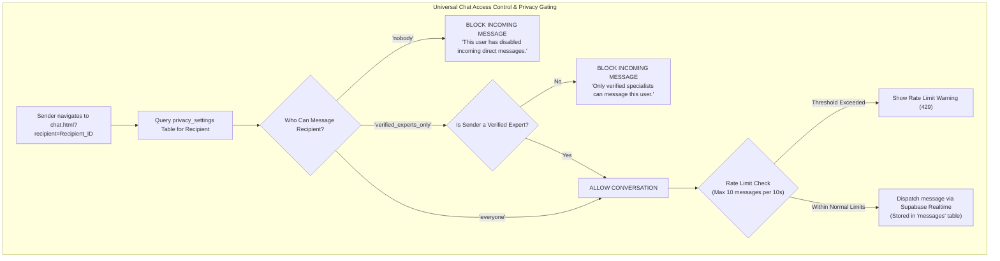
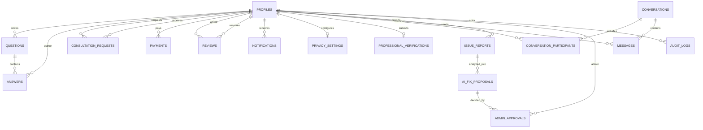

# AskExpert — Complete System Flow Chart & Architecture

This document contains the complete end-to-end architectural, user, expert, admin, and subsystem flow charts for the **AskExpert** platform.

---

## 1. Overall System Navigation & Role-Based Routing

---

## 2. Client / User Workflow

---

## 3. Professional / Expert Workflow

```mermaid
flowchart TD
    subgraph ExpertFlow ["Expert Journey: Verification, Answering & Earnings"]
        E_Start["Register as Expert (register.html)"] --> E_Login["Login (login.html)"]
        E_Login --> E_KYC["Professional Verification (professional-verification.html)<br/>• License/Bar Council number<br/>• Upload Credentials/Certificate"]
        
        E_KYC --> E_AI["AI Certificate Verifier (aiCertificateVerifier.js)<br/>• Validates certificate authenticity<br/>• Detects tampering/suspicious files"]
        E_AI -->|Passed Check| E_Pending["Status: 'pending_admin'<br/>Awaiting Admin Confirmation"]
        
        E_Pending -->|Admin Approves KYC| E_Dash["Professional Dashboard (professional-dashboard.html)"]

        %% Answering Inquiries
        E_Dash -->|Browse Feed| E_Feed["Questions Feed (questions.html)"]
        E_Feed --> E_Ans["Question Details (question-details.html)<br/>• Write & submit expert solution"]
        E_Ans -->|Insert Solution| DB_Ans["Insert to 'answers' Table"]

        %% Consultations & Income
        E_Dash -->|Manage Inbound Consultations| E_Req["Consultation Requests (consultation-requests.html)<br/>• Accept or Decline booking"]
        E_Req -->|Accepted| E_Chat["Consultation Room (chat.html)<br/>• Deliver 1-on-1 consultation"]
        E_Chat --> E_Earn["Professional Earnings (professional-earnings.html)<br/>• Completed consultations ledger<br/>• Escrow release & payout status"]
        E_Dash --> E_PubProfile["Professional Profile (professional-profile.html)<br/>• Public badges & verification seal"]
    end
```

---

## 4. Admin Governance & Platform Moderation

---

## 5. AI Fix Center & Safety Pipeline

```mermaid
flowchart TD
    subgraph AIFixPipeline ["AI Automated Diagnosis & Admin-Gated Execution"]
        Step1["User, Expert, or Admin encounters an issue or requests a feature"]
        Step1 --> Step2["Opens Report Issue Modal (reportIssueModal.js)<br/>• Selects Category (Bug, Feature, Security)<br/>• Provides Title, Context & Severity"]
        Step2 -->|Insert Record| Table_Reports["Supabase Table: issue_reports<br/>(status: 'pending_ai')"]

        Table_Reports --> Step3["AI Issue Analyzer (aiIssueAnalyzer.js)<br/>• Root-cause technical analysis<br/>• Unified diff patch generation<br/>• Confidence score & risk estimation"]
        Step3 -->|Insert Proposal| Table_Proposals["Supabase Table: ai_fix_proposals<br/>(status: 'pending_review')"]

        Table_Proposals --> Step4["Admin AI Fix Center (admin-ai-fix-center.html)<br/>• Admin views pending proposals<br/>• Inspects Unified Diff & impacted files"]

        Step4 --> Step5{"Admin Review Decision"}

        Step5 -->|REJECT| Step6["Proposal Marked: REJECTED<br/>• Issue closed with admin reason<br/>• Zero code changes made"]
        Step5 -->|APPROVE| Step7["Admin Enters Signature Notes & Approves"]

        Step7 --> Table_Approvals["Supabase Table: admin_approvals<br/>(Authorized execution token)"]
        Table_Approvals --> Table_Audit["Supabase Table: audit_logs<br/>(Cryptographic audit trail)"]
        Table_Audit --> Step8["Automated Notification to Reporter<br/>• Realtime update on issue resolution"]
    end
```

---

## 6. Multi-Tier Chat Privacy Gating Flow

---

## 7. Database Entity Relationship Overview

