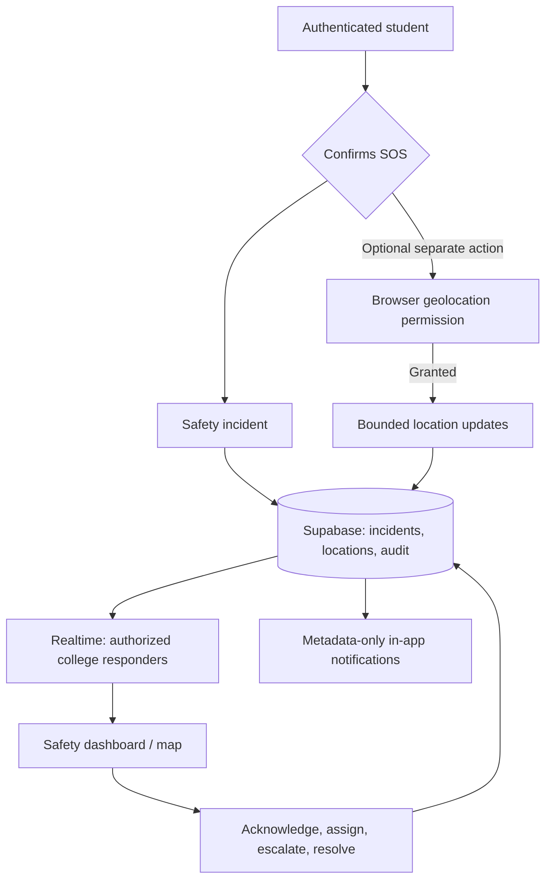
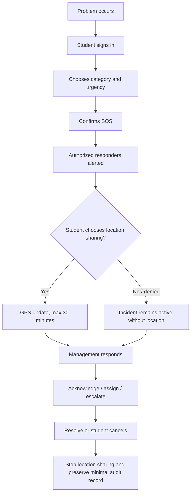

# AskExpert College Safety architecture and flow

## Access boundary

| Actor | Can do | Cannot do |
|---|---|---|
| Student | Create/read own incident, opt into bounded location, cancel | Read another student's incident or location |
| Assigned college responder | See only its college's active incidents, latest opted-in location, manage status/assignment | Read another college's incidents |
| Platform admin | Manage college and responder configuration | Bypass audited safety actions silently |

The client never contains a service-role key. Row-level policies plus server-side PostgreSQL functions enforce ownership, college scope, responder assignment, status lifecycle, location expiry, and escalation.

## Operational configuration

1. Create a `colleges` record.
2. Set each student's `profiles.college_id`, plus optional `department` and `academic_year`.
3. Add approved personnel to `safety_staff` and college emergency numbers to `safety_contacts`.
4. Document exactly who receives escalation Levels 1–3 and test the response process.
5. Set a retention schedule for closed incidents and location records before production.
